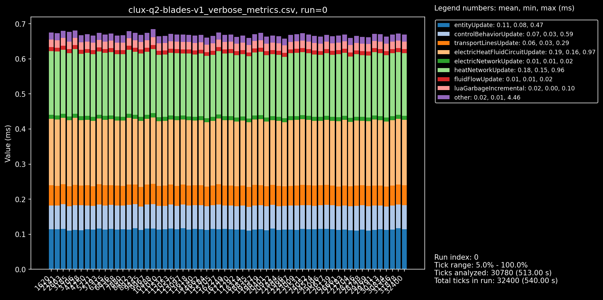
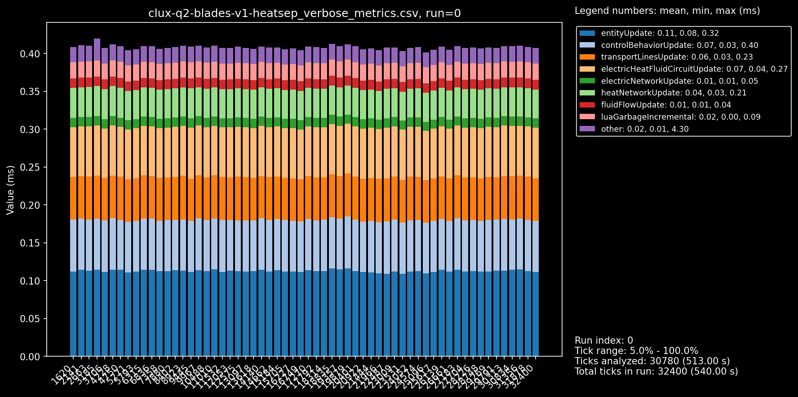
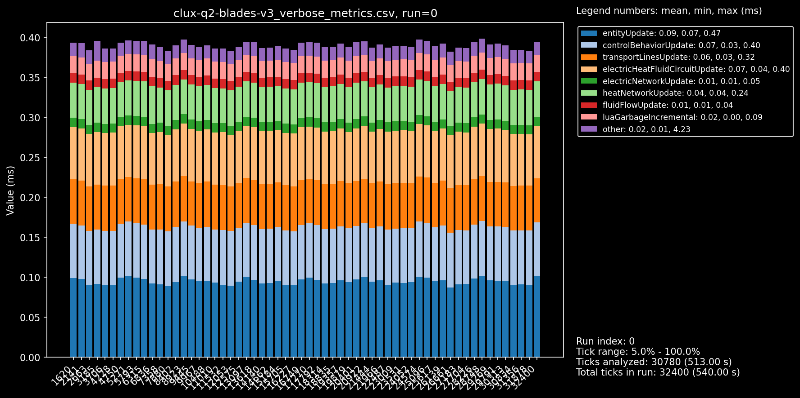

# Factorio Benchmark Results

**Platform:** linux-x86_64
**Factorio Version:** 2.0.73
**Date:** 2026-02-09

## Scenario
* Each save was tested for 32400 tick(s) and 25 run(s)

## Results
| Metric            | Description                           |
| ----------------- | ------------------------------------- |
| **Mean UPS**      | Updates per second – higher is better |
| **Mean Avg (ms)** | Average frame time – lower is better  |
| **Mean Min (ms)** | Minimum frame time – lower is better  |
| **Mean Max (ms)** | Maximum frame time – lower is better  |

| Save | Avg (ms) | Min (ms) | Max (ms) | UPS | Execution Time (ms) | % Difference from base |
|------|----------|----------|----------|-----|---------------------|------------------------|
| clux-q2-blades-v1 | 0.534 | 0.377 | 5.123 | 1872 | 86503 | 0.00% |
| clux-q2-blades-v1-heatsep | 0.402 | 0.255 | 4.918 | 2486 | 65156 | 32.75% |
| clux-q2-blades-v3 | 0.378 | 0.239 | 4.756 | 2643 | 61282 | 41.15% |
| clux-q2-blades-v5 | 0.361 | 0.205 | 4.186 | 2768 | 58511 | 47.83% |
| clux-q2-blades-v6 | 0.349 | 0.205 | 4.276 | **2862** | 56599 | 52.83% |

## Conclusion
This is basically comparing;

1. 8 blades of my current V6 (less heatpipes)
2. 8 blades of a previous V5 (better clocking, less heatpipes)
3. 8 blades of a previous V3 (with worse ice upcycling, and lithium less clocking overall)
4. 8 blades of original V1 (using **bots** for rocket parts)
5. 8 blades of original V1 (using **bots** and single **global heat network**)

note that i am testing the full pipeline here, including rocket launches, had a dummy platform over aquilo that voided all requests. 5x5m run.

.

### V1
obviously the oldest blade, using bots, single heatnetwork is at the bottom.
but look at the gap from just disconnecting the heat works (blue to orange line).
almost a 30% UPS boost JUST from disconnecting the blades' heat pipes!

compare the 2 v1 graphs (global network vs separated);

### V1 -> V3
then there's the second gap, which goes to the v3 blade, still doesn't have great clocking, but it is the first blade to **not** use bots for rocket parts. another 10%. i am surprised this is not more, it's 400 bots active. the green line also clocks lithium.

v3 graph

### V3 -> V5
from green to purple is basically only the smaller tweaks; better clocking, car DI on ice upcycling, less fluid voiding cryos. less heat pipes (less fluids on bus).

### V5 -> V6
only real difference here is 100 less heatpipes per blade substituting with cars.
tried optimizing gc on fluid voiding and it did nothing.

so the main takeaways is that you should do the easiest, least technical thing first;

1. separate heat networks (reduce green area in graphs above)
2. belt out components rather than use bots
3. then clock and optimize
