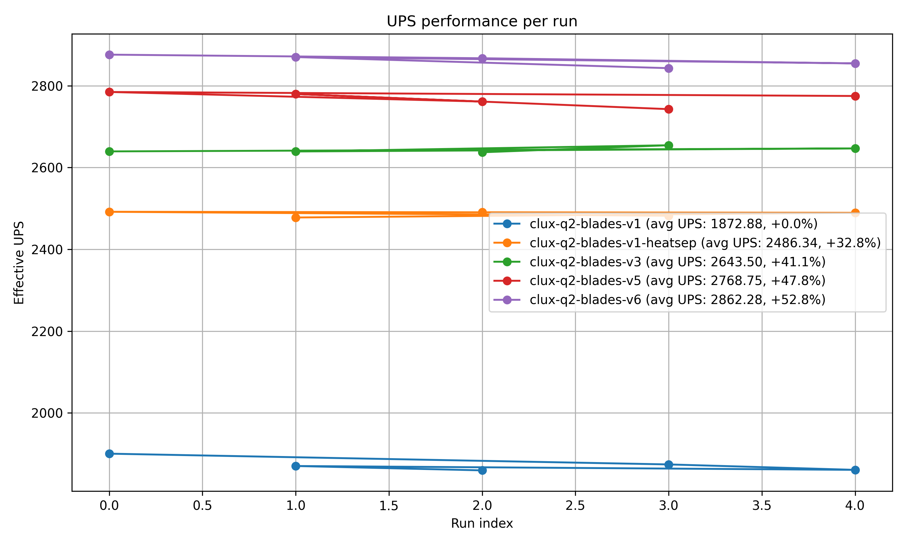
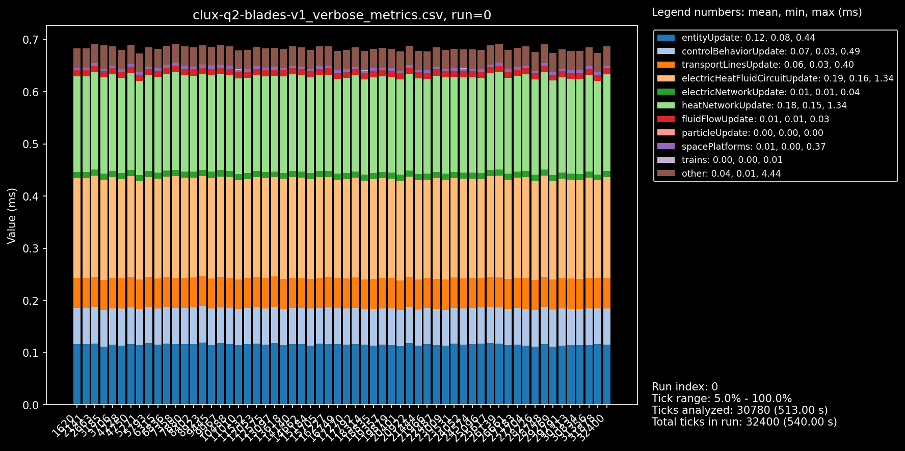
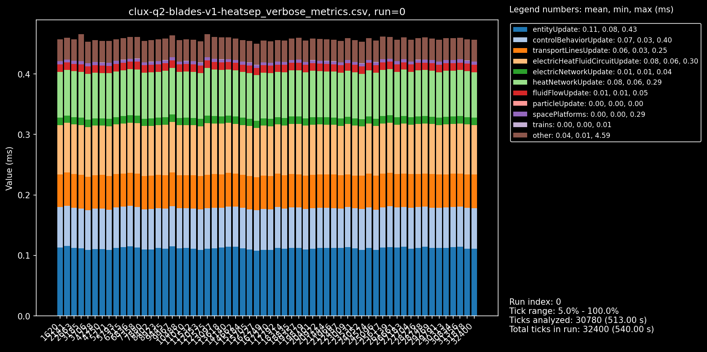
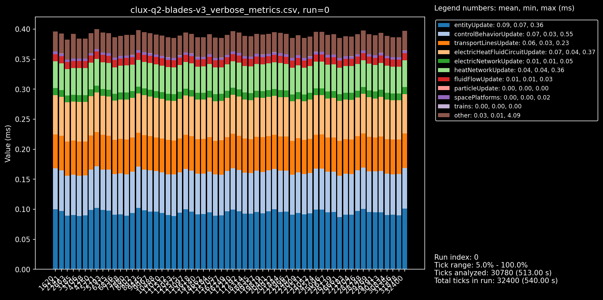
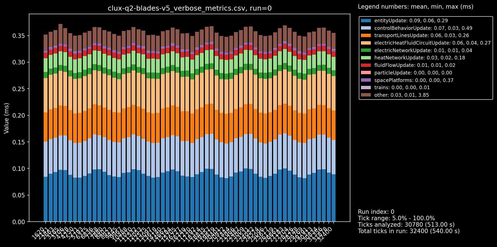
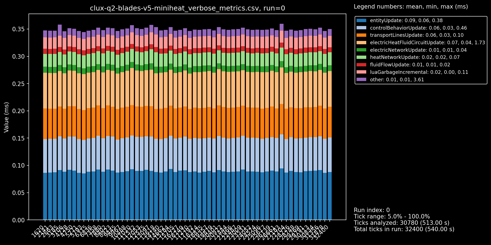

# Factorio Benchmark Results

**Platform:** linux-x86_64
**Factorio Version:** 2.0.73
**Date:** 2026-02-01

## Scenario
* Each save was tested for 32400 tick(s) and 5 run(s)

## Results
| Metric            | Description                           |
| ----------------- | ------------------------------------- |
| **Mean UPS**      | Updates per second – higher is better |
| **Mean Avg (ms)** | Average frame time – lower is better  |
| **Mean Min (ms)** | Minimum frame time – lower is better  |
| **Mean Max (ms)** | Maximum frame time – lower is better  |

| Save | Avg (ms) | Min (ms) | Max (ms) | UPS | Execution Time (ms) | % Difference from base |
|------|----------|----------|----------|-----|---------------------|------------------------|
| clux-q2-blades-v1 | 0.537 | 0.389 | 4.977 | 1863 | 86918 | 0.00% |
| clux-q2-blades-v1-heatsep | 0.415 | 0.283 | 5.016 | 2407 | 67287 | 29.18% |
| clux-q2-blades-v3 | 0.378 | 0.246 | 4.938 | 2647 | 61200 | 42.02% |
| clux-q2-blades-v5-miniheat | 0.370 | 0.233 | 4.361 | 2701 | 59965 | 44.95% |
| clux-q2-blades-v5 | 0.364 | 0.225 | 4.544 | **2745** | 58999 | 47.32% |

## Conclusion
This is basically comparing;

1. 8 blades of my current V5
2. 8 blades of a previous V3 (with worse ice upcycling, and lithium less clocking overall)
3. 8 blades of original V1 (using **bots** for rocket parts)
4. 8 blades of original V1 (using **bots** and single **global heat network**)

note that i am testing the full pipeline here, including rocket launches, had a dummy platform over aquilo that voided all requests. 5x5m run.

.

### V1
obviously the oldest blade, using bots, single heatnetwork is at the bottom.
but look at the gap from just disconnecting the heat works (blue to orange line).
almost a 30% UPS boost JUST from disconnecting the blades' heat pipes!

compare the 2 v1 graphs (global network vs separated);

### V1 -> V3
then there's the second gap, which goes to the v3 blade, still doesn't have great clocking, but it is the first blade to **not** use bots for rocket parts. another 10%. i am surprised this is not more, it's 400 bots active. the green line also clocks lithium.

v3 graph

### V3 -> V5
from green to purple is basically only the smaller tweaks; better clocking, car DI on ice upcycling, less fluid voiding cryos. less heat pipes (less fluids on bus).

the red line was an experiment to see if i took heat pipes to an extreme, basically separate everything so that each blade had 9 separate neetworks. surprisingly this was worse.
this may end up being statistical noise, but it does suggest there may be a sweet spot for how small you should make your heat networks.

compare v5 to v5 maximally separated;

so the main takeaways is that you should do the easiest, least technical thing first;

1. separate heat networks (reduce green area in graphs above)
2. belt out components rather than use bots
3. then clock and optimize
