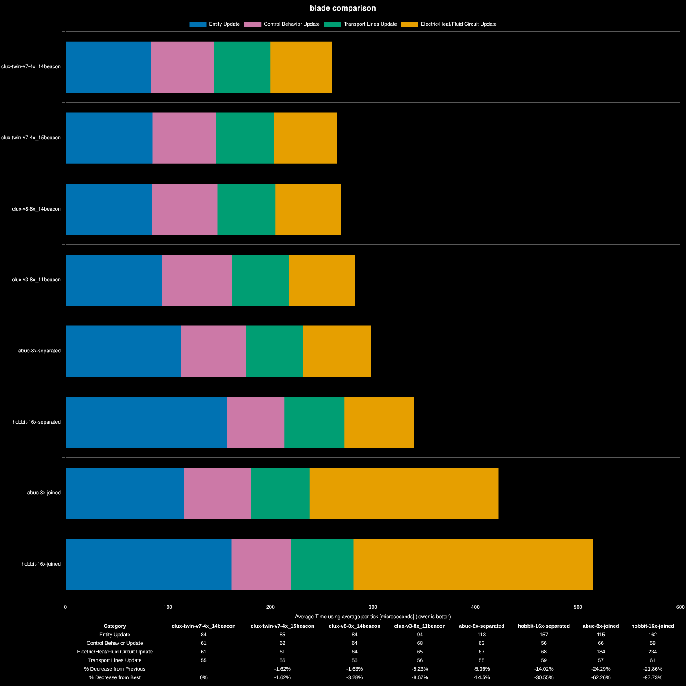

# Factorio Benchmark Results

**Platform:** linux-x86_64
**Factorio Version:** 2.0.75
**Date:** 2026-02-21

## Scenario
* Each save was tested for 108000 tick(s) and 40 run(s)

## Results
| Metric            | Description                           |
| ----------------- | ------------------------------------- |
| **Mean UPS**      | Updates per second – higher is better |
| **Mean Avg (ms)** | Average frame time – lower is better  |
| **Mean Min (ms)** | Minimum frame time – lower is better  |
| **Mean Max (ms)** | Maximum frame time – lower is better  |

| Save | Avg (ms) | Min (ms) | Max (ms) | UPS | Execution Time (ms) | % Difference from base |
|------|----------|----------|----------|-----|---------------------|------------------------|
| abuc-8x-joined | 0.523 | 0.267 | 4.700 | 1911 | 282548 | 19.70% |
| abuc-8x-separated | 0.396 | 0.163 | 4.506 | 2524 | 213874 | 58.14% |
| clux-twin-v7-4x_14beacon | 0.355 | 0.142 | 3.815 | **2816** | 191707 | 76.42% |
| clux-twin-v7-4x_15beacon | 0.356 | 0.152 | 4.270 | 2805 | 192496 | 75.70% |
| clux-v3-8x_11beacon | 0.378 | 0.207 | 4.724 | 2643 | 204300 | 65.55% |
| clux-v8-8x_14beacon | 0.360 | 0.185 | 4.213 | 2779 | 194317 | 74.05% |
| hobbit-16x-joined | 0.626 | 0.430 | 6.740 | 1596 | 338209 | 0.00% |
| hobbit-16x-separated | 0.444 | 0.213 | 5.964 | 2250 | 239953 | 40.95% |

## Setup

This is basically comparing 4 of my blades (2 solo variants; v3 + v8, and 2 twin variants, v7 with 14 and 15 beaconing) against historical blades (Abuc's and Hobbits as a frame of reference).

Tests are using full launch pipeline with a ship voiding science using 6 launches, then waiting on fulgora until sufficient time has passed so that throughput matches 240*16 science/s equivalent. It's described and shown in the blade video.

.

## Conclusion
Priority for aquilo ups optimization in order depending on what you have done:

1. separate heat networks (30-40% improvement on the table if you have it all in one network, compare joined/separated)
2. belt out components rather than use bots (10% improvement on the table, see gap to V3)
3. clock, optimize, tweak (another 10%+, see V3 -> V7 gap)

Going behind the dumb mistake of connecting all the heat networks; **heat pipe count** also matters relatively. Check your Heat Network costs in the debug menu (F5 + show entity time usage). Mine sits at `0.04` now.

## Minor Optimizations
if you've done 1. and 2. Other things to do;

- reduce heatpipes
- sushi rocket components (less heatpipes), remove bot networks
- max beacon (14/15) science (needs vehicles)
- clock + DI lithium (can use generator)
- clock science inserters (can use generator)
- pressurise fluid voider (high value latch)
- down-tune ice upcycler speed, maybe colocate with science
- optimize load sequence (prevent silo targeting inserters from being active except while rocket comes up)

at least these worked for me, and they bench positively.
(kind of the TL;DR of the video ^)
