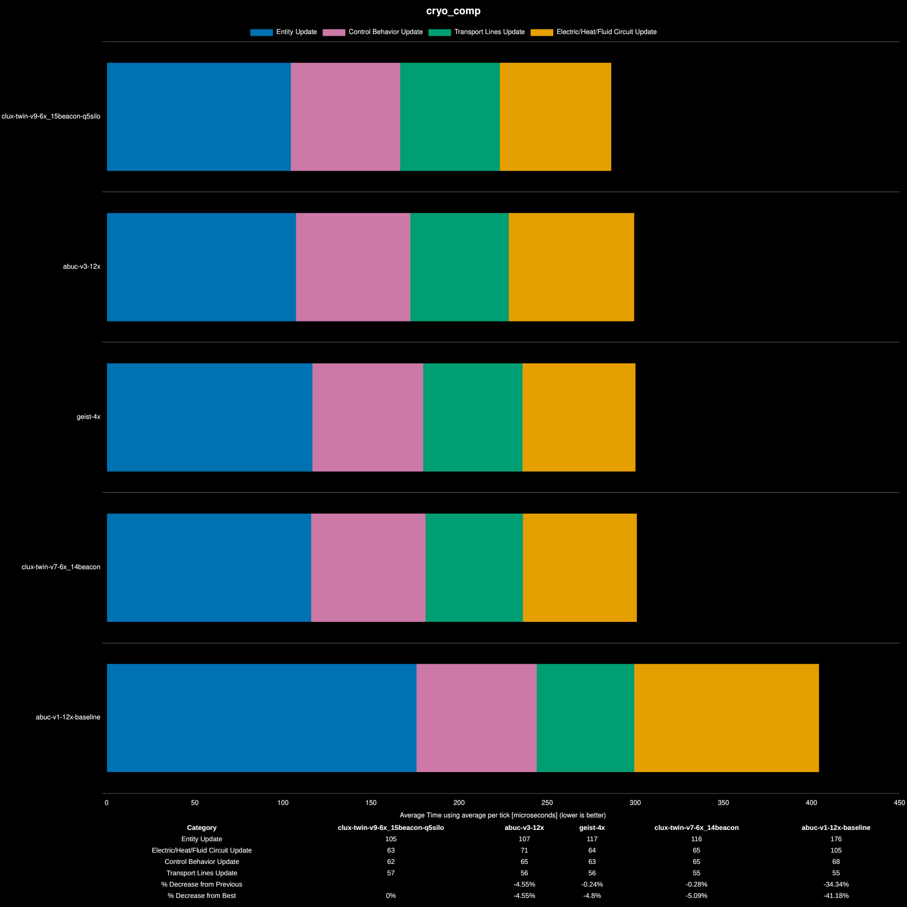

# cryo v9 bench

## Test Setup
as explained in original cryo blade video;

- ships pulling precise amounts (12 belts), ship waits if necessary to ensure even pull for fairness.
- all blades must be self-sufficient on cold fluro
- all tests have a giant fusion reactor to try to compensate for heat network bias (didn't work)
- all cars disabled via mod

## Sanitize Output
to prove similar production rates;

- abuc v1 baseline :: `produced: uncommon-cryogenic-science-pack (1728004.5)`
- abuc v3 :: `produced: uncommon-cryogenic-science-pack (1728152.3)`
- clux twin v7 14 beacon :: `produced: uncommon-cryogenic-science-pack (1725220.1)`
- clux twin v9 15 beacon :: `produced: uncommon-cryogenic-science-pack (1720033.5)`
- Geist :: `produced: uncommon-cryogenic-science-pack (1727980)`

see scripts.

## Benchmark Results

**Platform:** linux-x86_64
**Factorio Version:** 2.0.76
**Date:** 2026-04-09

## Scenario
* Each save was tested for 108000 tick(s) and 20 run(s)

## Results
| Metric            | Description                           |
| ----------------- | ------------------------------------- |
| **Mean UPS**      | Updates per second – higher is better |
| **Mean Avg (ms)** | Average frame time – lower is better  |
| **Mean Min (ms)** | Minimum frame time – lower is better  |
| **Mean Max (ms)** | Maximum frame time – lower is better  |

| Save | Avg (ms) | Min (ms) | Max (ms) | UPS | Execution Time (ms) | % Difference from base |
|------|----------|----------|----------|-----|---------------------|------------------------|
| abuc-v1-12x-baseline | 0.508 | 0.345 | 9.022 | 1967 | 219523 | 0.00% |
| abuc-v3-12x | 0.397 | 0.207 | 8.830 | 2520 | 171402 | 28.08% |
| clux-twin-v7-6x_14beacon | 0.400 | 0.235 | 6.731 | 2499 | 172867 | 26.99% |
| clux-twin-v9-6x_15beacon-q5silo | 0.382 | 0.221 | 7.368 | **2615** | 165160 | 32.92% |
| geist-4x | 0.396 | 0.218 | 7.481 | 2527 | 170910 | 28.45% |

## Conclusion

The raw numbers here are very misleading to look at in isolation because a big part of the reason why my blade perform so much better is because of large scale pointless heatpipe optimization that will not show up in the real game.

The heat network optimizations - while they reduce calculations in total - do not matter for your UPS in a realistic scenario as they are multithreaded and run together with fluid update and electric network calculations, and in the real game, this cost is always dominated by the electric network costs (unlike in benchmarks where heat pipe dominate because we only test one planet).

Thus you need to look at the **enty cost** (blue bar) breakdown;

And with this breakdown, abuc's and mine are basically identical.
