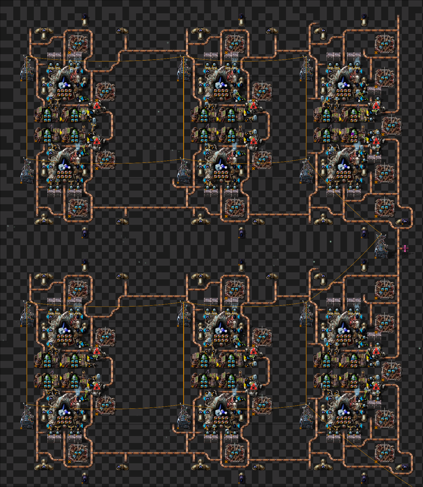
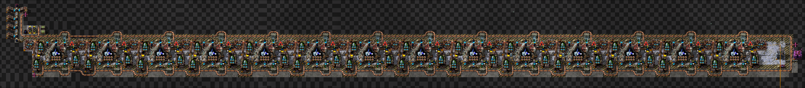
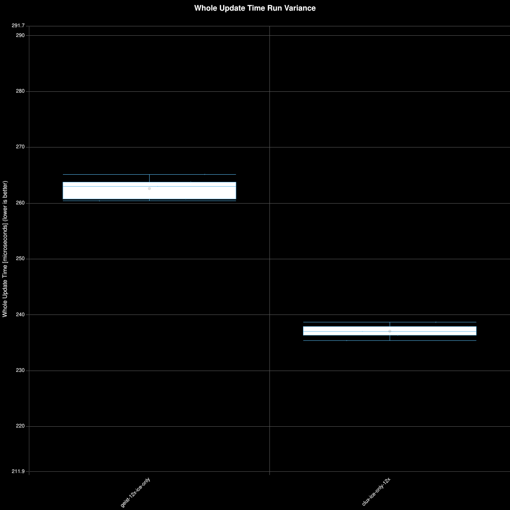
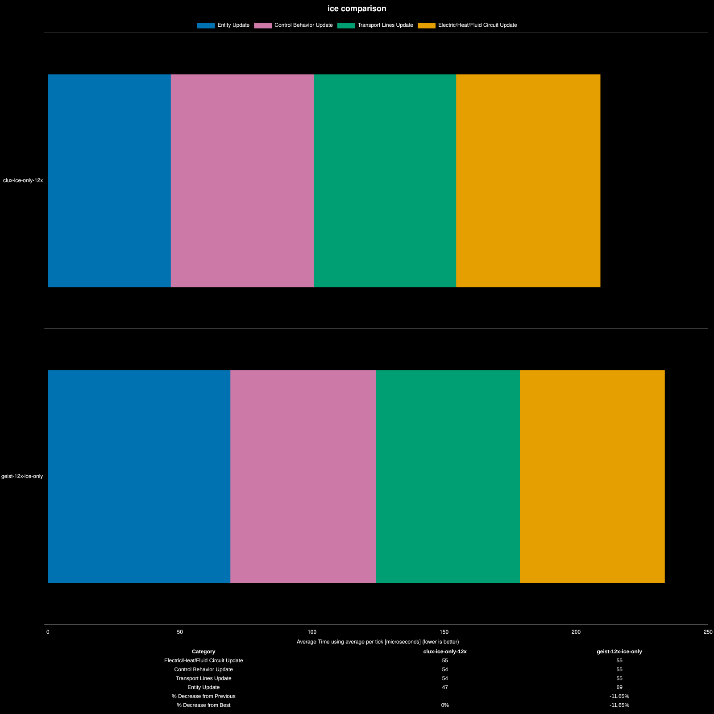

# Factorio Benchmark Results

**Platform:** linux-x86_64
**Factorio Version:** 2.0.76
**Date:** 2026-02-27

## Scenario
* Each save was tested for 10800 tick(s) and 10 run(s)

## Results
| Metric            | Description                           |
| ----------------- | ------------------------------------- |
| **Mean UPS**      | Updates per second – higher is better |
| **Mean Avg (ms)** | Average frame time – lower is better  |
| **Mean Min (ms)** | Minimum frame time – lower is better  |
| **Mean Max (ms)** | Maximum frame time – lower is better  |

| Save | Avg (ms) | Min (ms) | Max (ms) | UPS | Execution Time (ms) | % Difference from base |
|------|----------|----------|----------|-----|---------------------|------------------------|
| clux-ice-only-12x | 0.238 | 0.157 | 2.404 | **4202** | 12848 | 10.68% |
| geist-12x-ice-only | 0.263 | 0.174 | 2.724 | 3797 | 14220 | 0.00% |

## Designs compared

### Geist

- 12 cryos running at 235/s. (feeding 3 belts of sicence)
- 4 copies producing 180k/s Q2 and 420k/s Q1
[bp](./geist.txt)

### clux

- 14 cryos running at 114/s (feeding 2 belts of science)
- 6 copies producing 180k/s Q2 and 280k/s Q1

[bp](./clux.txt)

## Breakdown

