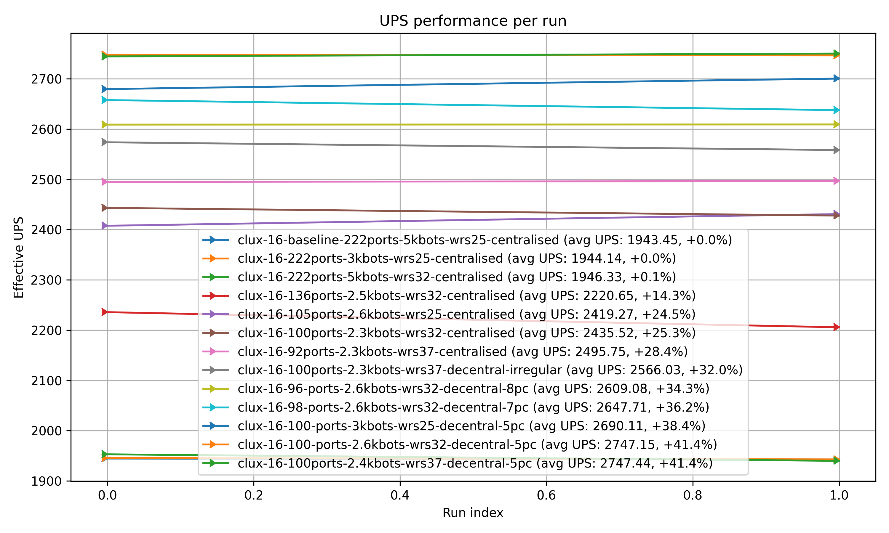

# Hub Layout and Roboport Comparison

An appendix to the Megabase Hub Scaling video.

## Results

Legend;
- wrs = worker robot speed
- 3kbots bot numbers, thousands
- XXXports, number of roboports
- centralised, roboports packed around center
- decentralised, roboports spaced out evenly around chunks (5pc = 5 ports per chunk)

## Important Takeaways
1. Roboports number is the most important thing to optimize. You can scale them down aggressively.
2. Bot number reduction is also powerful (less so, but still important)
3. Separating roboport clusters by chunks eeks out a win over traditional packed designs
4. worker robot speeds not useful by itself, but it gives headroom which then gives you performance boosts when you trim this.
