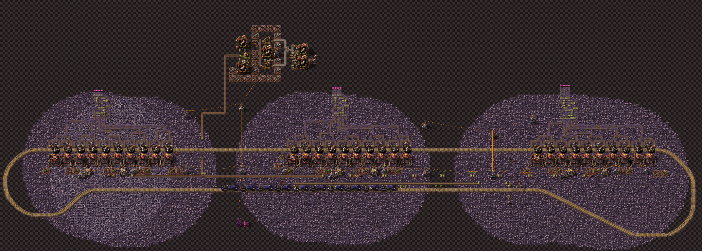
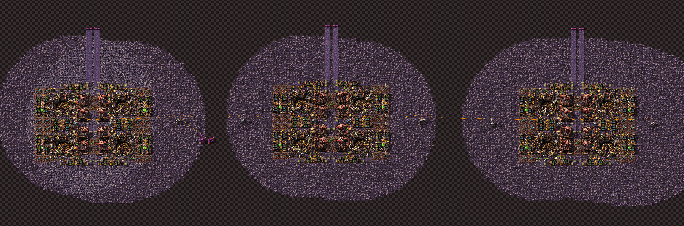
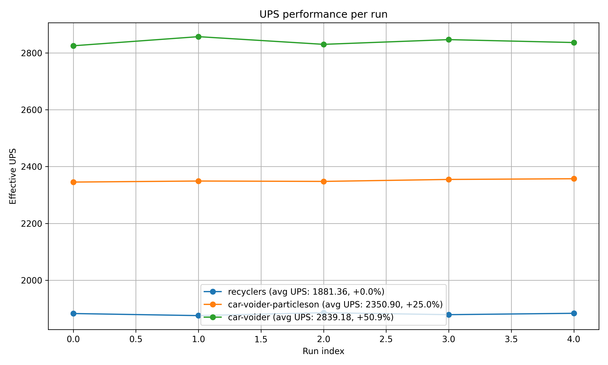
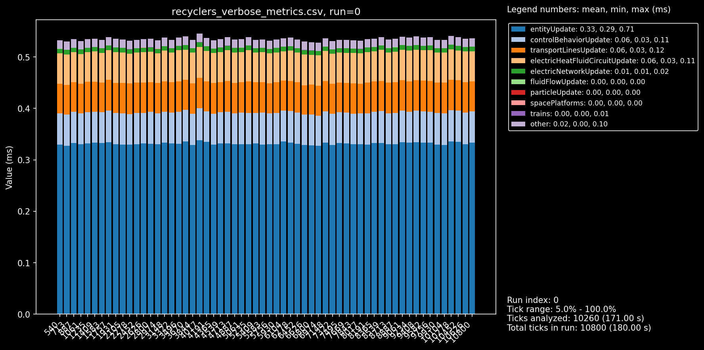
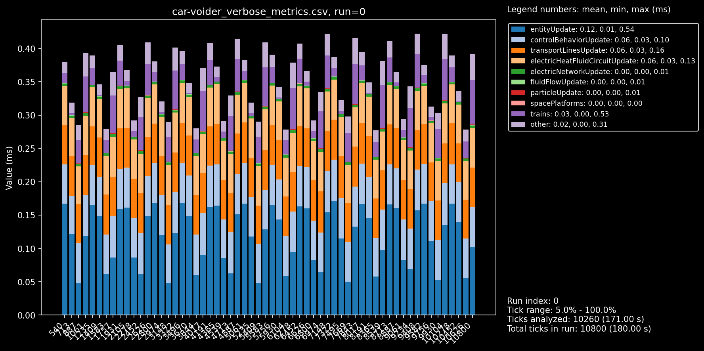
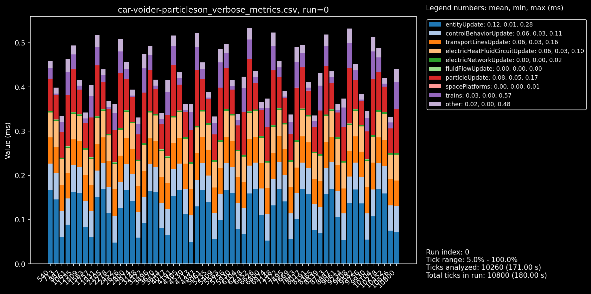

# Vulvanus Tungsten Upcyclers

**Beats silo+recycler based upcycling by >50% when disabling car particles.**

**[blueprint](./train-voider-1.txt)**

## Setup
Scaled for mining prod >5700.
Highly specific mining patch setup. You'll probably need to adjust the train/rail setup in your base. This is a mostly a POC to show it's good, but it also reflects my actual use on my 3 best patches.

Works best with @MRX8024 UPS mods; [disable-vehicle-particles](https://mods.factorio.com/mod/disable-vehicles-particles) + [disable-vehicles](https://mods.factorio.com/mod/disable-vehicles) (the particle one being the important one).

## Benchmark

comparing to abuc's old ore recyclers tuned to 7k for tungsten.

### Caveats
- including car production costs but excluding q5 rocketfuel costs (get from fulgora islands) and molten iron
- excluding space platform costs on recycler setup

NB: tested with 4 copies of the above. could probably have scaled it more to offset the game's minimum game update, but this is not super precise anyway.

the train recycler setup is not completely maxed either. i just took the one scaled for my metallurgic which is fine with like 95% - 98% so you might need to adjust tick timers / belt buffers to maxx it fully.

### Benchmark Results
 + [report](./results.md).

### breakdowns
recycler setup:

trains without particles (mods on)

trains with particles (no mods)

