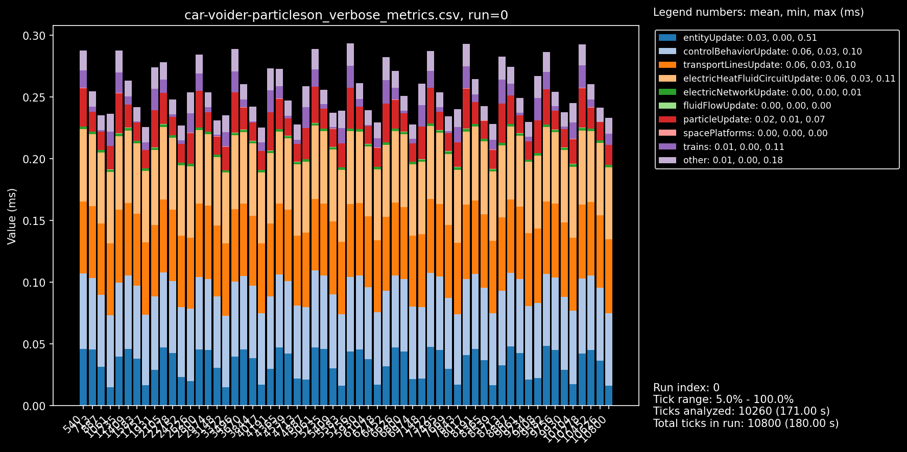

# Vulvanus Tungsten Upcyclers

**Beats silo+recycler based upcycling by >30% when disabling car particles.**

**[blueprint](./train-voider-1.txt)**

## Setup
Scaled for mining prod >5700

Relies on @MRX8024 UPS mods; [disable-vehicle-particles](https://mods.factorio.com/mod/disable-vehicles-particles) + [disable-vehicles](https://mods.factorio.com/mod/disable-vehicles) (the particle one being the important one).

## Benchmark

comparing to abuc's old ore recyclers tuned to 7k for tungsten.

### Caveats
- including car production costs but excluding q5 rocketfuel costs (get from fulgora islands) and molten iron
- excluding space platform costs on recycler setup

### Benchmark Results
 + [report](./results.md).

### breakdowns
recycler setup:

trains without particles (mods on)

trains with particles (no mods)

