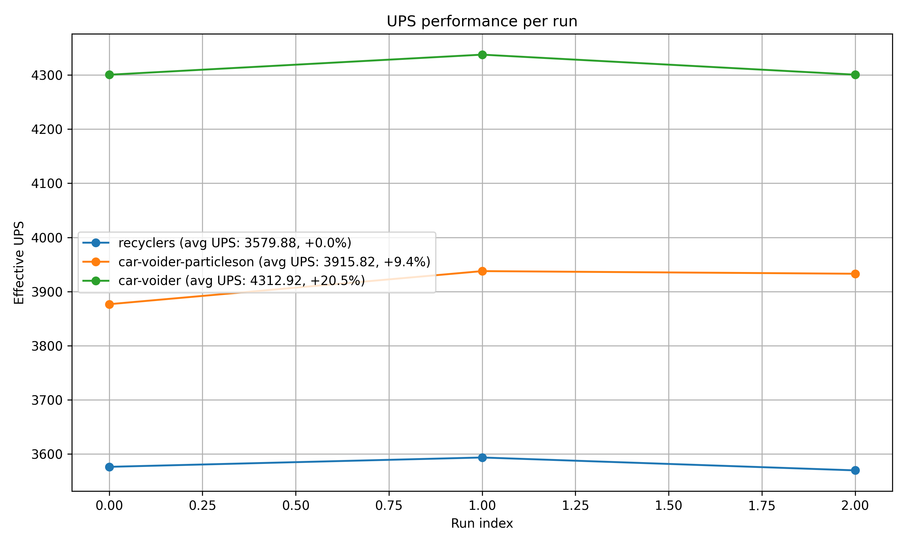

# Vulvanus Tungsten Upcyclers

**Beats silo+recycler based upcycling by >30% when disabling car particles.**

**[blueprint]()**

## Setup
Scaled for mining prod >5700

Relies on @MRX8024 UPS mods; [disable-vehicle-particles](https://mods.factorio.com/mod/disable-vehicles-particles) + [disable-vehicles](https://mods.factorio.com/mod/disable-vehicles) (the particle one being the important one).

comparing to abuc's old ore recyclers tuned to 7k for tungsten.

### Benchmark Results
 + [report](./results.md).

breakdowns;

